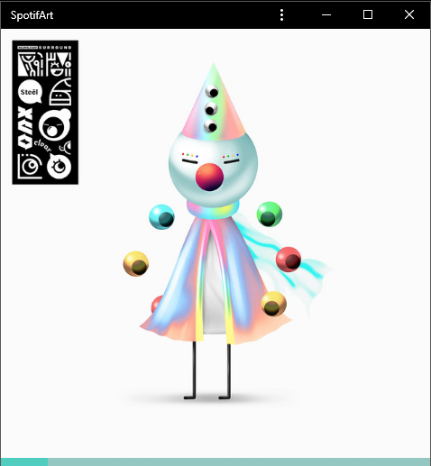
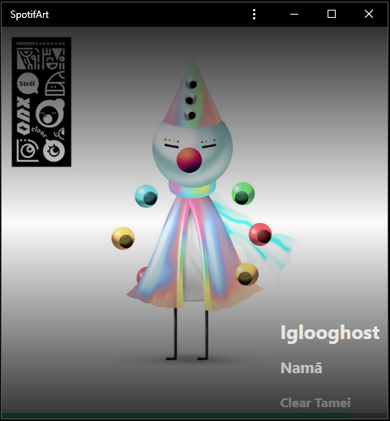
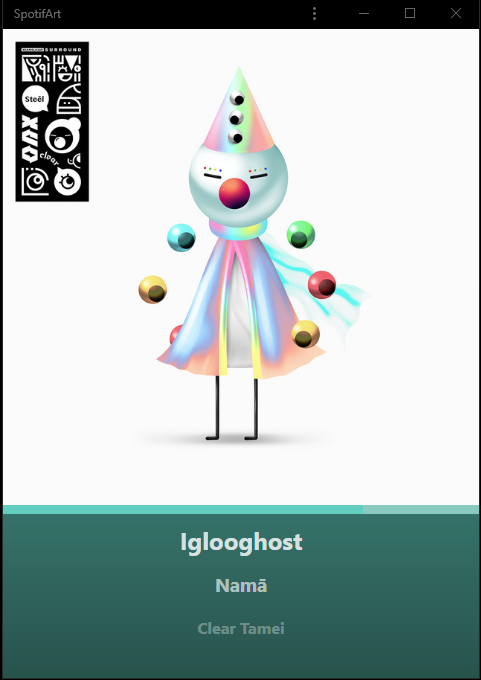

# SpotifArt

Displays album art of the track you're currently listening to in Spotify.

Optimized for large and small windows.

# Examples:

## Large View

## Small View

In small view, the album art takes the full width of the window. Also, the progress bar moves to be above the meta-data, but still below the art.

In the small view, you can view song meta data by hovering your mouse over the window.

If you prefer, you can also always see the meta-data by increasing the height of the window.

